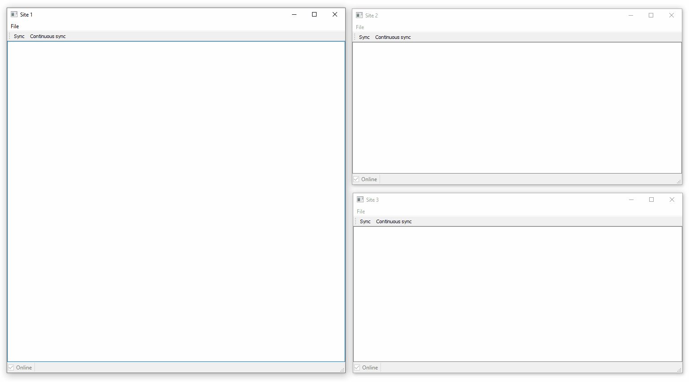
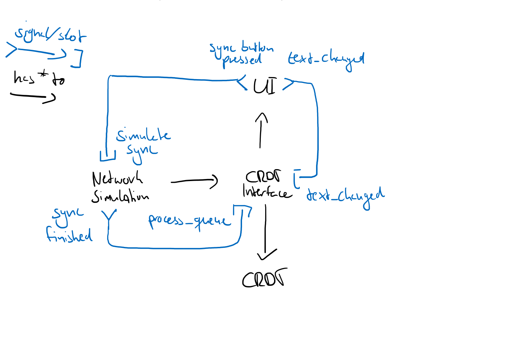

# CRDT text editor

Minimal collaborative Text Editor to test my implementation of [Replicated Growable Array (RGA)](https://git.rwth-aachen.de/reitz/crdt)

Text is stored in the RGA, with each element in the RGA being a string with one character.
This should be a String, because utf-8.

The RGA is accessed via a CRDTInterface, which is a QObject and provides signal-slot capabilities.

I also use a NetworkSimulation Class, which distributes local operations to other replicas.

